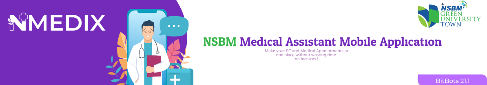
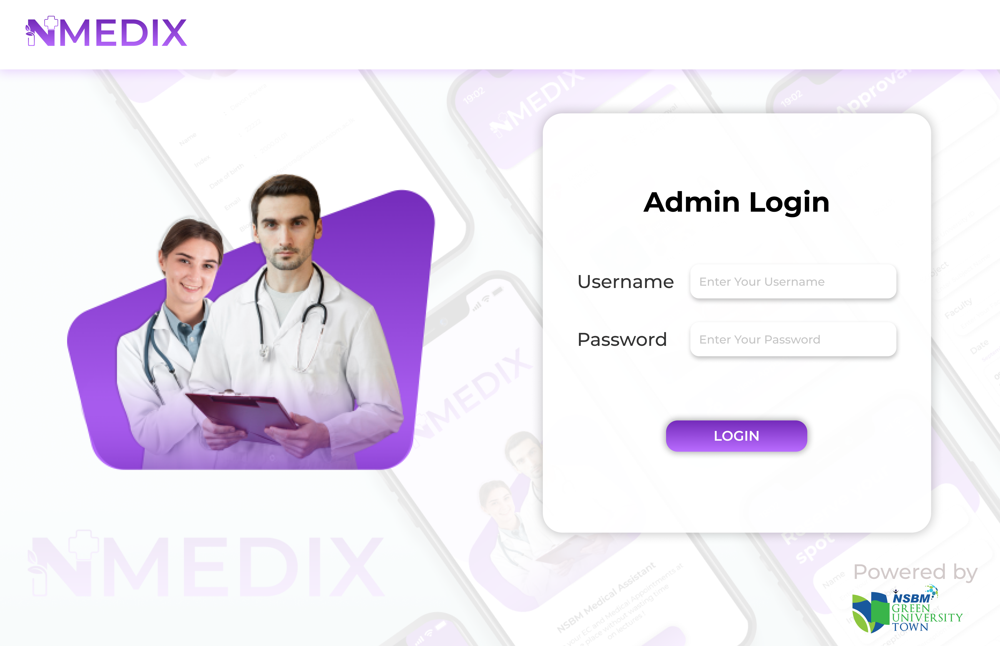
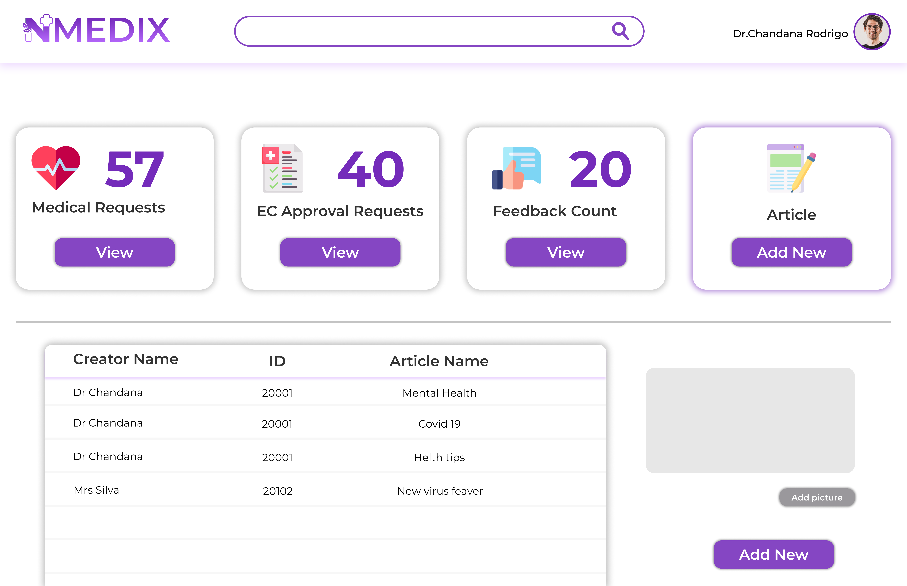
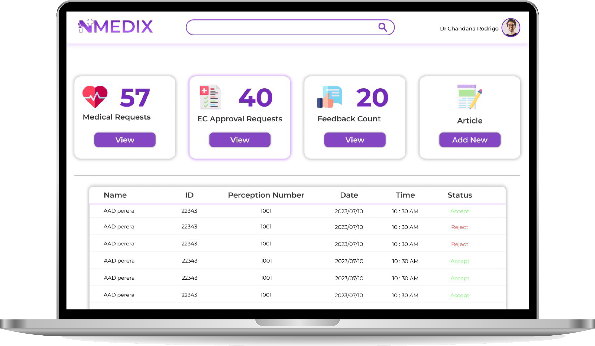

# nmedix web application 
#  

 

## Introduction
NSBM Green University prioritizes health care for staff and students, offering personalized medical advice and treatments to address individual medical needs in a fast-paced society, addressing the challenges posed by environmental pollution and hectic schedules.
In light of all the issues, user demands, and expectations, we advise the medical facility to adopt the mobile application NMEDIX. This mobile application makes it easier for medical facilities to complete their jobs quickly and effectively.

## UI and Introduction

> Admin Login

The Admin login window contains fields where a username and password can be entered. Users fill out the username box with their unique identifiers. The password field is where users can enter their private account password.

> Article dashboard

The article dashboard interface provides access to various informative articles covering different topics. It includes sections such as N Medix launch, health tips, COVID-19, and mental health. The N Medix launch section features articles related to the recent launch of N Medix, which may include information about its features, services, or updates. 

> Medical appointment

The appointment interface includes fields for the following information: name, index number, perception number, and date-time section. In the name field, the user can enter their full name. The index number field allows the user to input a unique identifier associated with their appointment. The perception number field is provided for the user to enter any specific identification or reference number related to their appointment.

